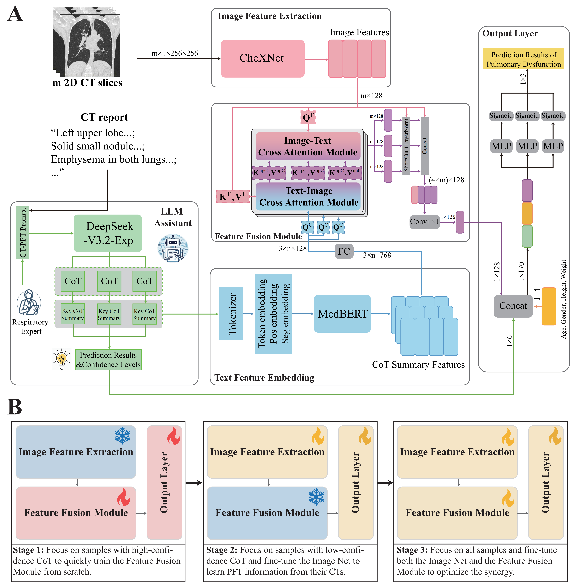

# LUMEN
Codes for "Prediction of Pulmonary Dysfunction from Chest CT Scans via a Large-language-model Guided Multimodal Framework"

## Contents
- [Use Terms](#use-terms)
- [Introduction](#introduction)
- [Model](#model)
- [Deployment](#deployment)
- [Requirements](#requirements)
- [Installation](#installation)

## Use Terms

### Intellectual Property and Rights Notice
All content within this repository, including but not limited to source code, models, algorithms, data, and documentation, are subject to applicable intellectual property laws. The rights to this project are reserved by the project's author(s) or the rightful patent holder(s).

### Limitations on Commercial Use
This repository's contents, protected by patent, are solely for personal learning and research purposes, and are not for commercial use. Any organizations or individuals must not use any part of this project for commercial purposes without explicit written permission from the author(s) or rightful patent holder(s). Violations of this restriction will result in legal action.

### Terms for Personal Learning and Academic Research
Individual users are permitted to use this repository for learning and research purposes, provided that they abide by applicable laws. Should you utilize this project in your research, please cite our work as follows:

> Zhou, J., Hang, Y., Bin, H. et al. Prediction of Pulmonary Dysfunction from Chest CT Scans via a Large-language-model Guided Multimodal Framework.

## Introduction
Pulmonary function testing (PFT) is the clinical standard for diagnosing chronic respiratory diseases, yet its utility is often limited by accessibility constraints and patient compliance. While computed tomography (CT) captures structural lung abnormalities associated with pulmonary dysfunction, existing deep-learning diagnostic models typically rely solely on imaging or struggle to effectively integrate unstructured clinical text. 

Here, we present LUMEN, a unified multimodal artificial intelligence framework for the automated prediction of both obstructive and restrictive ventilatory impairments. The framework leverages a large language model with medical chain-of-thought prompting to distill heterogeneous CT reports into structured reasoning features, which are then fused with CT image representations via a bidirectional cross-attention mechanism. To mitigate class imbalance and ensure the reliability of the generated reasoning text, we implemented a confidence-aware three-stage training strategy. Validated on 5,401 patients from three medical centers, LUMEN accurately identified high-risk populations based on multimodal clinical characteristics (i.e., CT images, CT reports, etc), consistently outperforming state-of-the-art unimodal and multimodal baselines.
## Model
The overall architecture of the proposed LUMEN model is shown in Figure 1A. The model takes as input preprocessed coronal CT images, key CoT summary text, and a vector of basic patient information, including gender, age, height and weight. The outputs are three binary variables corresponding to the three diagnostic tasks. LUMEN consists of one auxiliary module and four main modules: an LLM assistant module, an image feature extraction module, a text feature embedding module, a feature fusion module, and an output layer. Figure 1B shows the training curriculum, CATS. This three-stage strategy enables the LUMEN to perceive the quality of large language model reasoning, achieving coordination and synergy across all modules.

## Deployment
To facilitate clinical adoption, we deployed the LUMEN model on our previously developed online platform [seeyourlung.com](https://seeyourlung.com), enabling the system not only to infer pathological subtypes of pulmonary nodules but also to predict pulmonary dysfunction directly from CT imaging. The snapshots of the platform are displayed in Figure 2. This platform enables an automated, multimodal assessment of pulmonary dysfunction through an intuitive interface. Users first enter basic demographic information (date of birth, sex, height, and weight) and upload chest CT scans in DICOM format. After that, the CT-based model automatically estimates the probabilities of three major forms of pulmonary dysfunction and provides a corresponding diagnostic result. If the user also provides the free-text CT report, the platform invokes the CT+CTR model developed in this study to provide refined predictions. An optional LLM-assisted mode is also available, when selected, DeepSeek-V3.2-Exp performs automated clinical reasoning, after which the final prediction is generated using the proposed LUMEN model. Among the inputs, demographic information and CT scans are required. The CT report and LLM inference are optional. To protect patient privacy, all uploaded DICOM files undergo automated de-identification upon submission, and no user-uploaded data are stored on the platform.

## Requirements
The code is written in Python and requires the following packages: 

* Python==3.8.12
* matplotlib==3.5.1
* matplotlib-inline==0.1.3
* numpy==1.23.5
* openai==1.65.5
* opencv-python==4.5.5.64
* openpyxl==3.1.5
* pandas==1.4.1
* pkuseg==0.0.25
* pydicom==2.4.4
* PyWavelets==1.4.1
* scikit-image==0.21.0
* scikit-learn==1.0.2
* scipy==1.8.0
* seaborn==0.11.2
* SimpleITK==2.3.0
* sklearn==0.0
* torch==1.11.0+cu113
* torchaudio==0.11.0+cu113
* torchinfo==1.8.0
* torchvision==0.12.0+cu113
* tornado==6.1
* tqdm==4.67.1
* transformers==4.46.3

You can just run the following command to install the required packages：
* pip install -r requirements.txt
